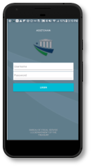

### FIT DLT Physical Asset Tracking PoC

This post contains the code for “Physical Asset Manager,” the blockchain prototype developed by the Office of Financial Innovation and Transformation (FIT) as part of a proof-of-concept (PoC). FIT used physical asset tracking, specifically the mobile phone inventory process at the Fiscal Service, as the use case for the PoC. This post contains a detailed description of the business process that was redesigned for the purposes of the PoC with complete setup instructions.

## Background

The purpose of this post is to share an example of a blockchain PoC, carried out by FIT, to learn about the different uses of blockchain technology and spur further exploration and adoption of the technology in the government. This post exemplifies the open source nature of blockchain and FIT encourages others to test the code, build on what was started as a minimum viable product in the FIT PoC, and share feedback or lessons learned with FIT. This PoC utilized blockchain to reimagine the way asset tracking was conducted at the Bureau of the Fiscal Service (Fiscal Service).  For the purposes of the PoC, FIT only tested the prototype on Samsung mobile phones to mirror the mobile phones currently supported by the Fiscal Service.  No other physical assets were part of the PoC.  
The following describes the current user roles and responsibilities in the mobile phone tracking process at the Fiscal Service:

### Property Management (PM):
Responsible for receiving new phones at the Fiscal Service warehouse from the vendor (Samsung). The following describes their responsibilities:

Receive new phones from vendor  
Associate an assetID to the device and place an assetID barcode on the phone  
Register phone to HP Asset Manager (the asset inventory system used by Fiscal Service) 
Send mobile phones to personnel at End User Support (EUS) who ordered the phone(s) 
Perform annual inventory by manually scanning phones 

### End User Support (EUS):
Has personnel stationed across various Fiscal Service field offices and has the following responsibilities:

Obtain phones from PM 
Assign phones to employees via the HP Asset Manager tool/ Active Directory 
Configure/Install Software on mobile phones 
Physically transfer the mobile phones to assigned employees 
Collect phone from employee upon break/expiration/termination of employment 

### Employee:
User of device; accountable for the device assigned to them. For background purposes, Employees experienced the following shortcomings in the current state process: 
Lack of visibility into the devices that have been assigned to their names (e.g. System shows an employee was assigned an iPhone 8, however he received a Blackberry) 
Limited visibility into inventory compliance 

## FIT DLT Solution

The DLT solution contains multiple components designed to address many of the current state challenges. The solution contains:
A mobile application that can be installed on any Android mobile device. The application captures and logs blockchain transaction data throughout the lifecycle of the phones. For employees, the application captures phone and app logins of the user and logs this activity providing a live, uncontested inventory of the phone.
A permissioned blockchain network, Ethereum (Parity), which immutably logs transaction data related to the phone's lifecycle and employee usage.
A read-only web application that provides Treasury leadership, Property Management, and End User Support a dashboard with an overview of the mobile device inventory at Fiscal Service. The dashboard reflects the active state of the blockchain.

The following diagram outlines the tech components used in this solution:

This solution provides near real-time, uncontested device inventory and alleviates PM and regional property custodians from having to perform an annual device inventory manually. Rather, the Blockchain app serves as the mechanism for recording a live inventory to capture employee usage of the phones. The following diagram describes the tokenization process of creating digital assets onto the blockchain that represent physical devices:

  

## Setup Instructions

Hosting Infrastructure Setup
The FIT blockchain PoC requires medium size Ubuntu Xenial 16.04 virtual machines to run appropriately. The following is an example setup that can be used:

BAL: (Business Abstraction Layer) where NodeJS backend and apache webserver will be hosted; resides in the public subnet 
Member 1 Node:  This node resides in the public subnet and serves as an access point into the private subnet 
Member 0 Node:  Resides in the private subnet; supports the blockchain network and processes transactions 
Authority Node 0:  Responsible for signing off on blocks and adding them to the network; resides in the private subnet 
Authority Node 1:  Responsible for signing off on blocks and adding them to the network; resides in the private subnet 
Authority Node 2:  Responsible for signing off on blocks and adding them to the network; resides in the private subnet 

## Software Installation Instructions

Below is a list of software that need to be installed on the machines:

1. BAL: NodeJS, Docker, EthStats 
2. Ethereum nodes: Parity Playground PoA, Docker, Docker Swarm 

## Parity Setup

Parity Configuration:
[Parity Setup Instructions](https://github.com/orbita-center/parity-poa-playground)

## EthStats Setup:

eth-netstats
[eth-netstats setup](https://github.com/cubedro/eth-netstats)

eth-net-intelligence-api
[eth-net-intelligence-api setup](https://github.com/cubedro/eth-net-intelligence-api)

## API Integration and Network Security Setup:

Within the web and android app, the API calls within the javacript and C# code need to be edited to account for the new IP address of the BAL node that is used.
Ports must be opened for use on cloud VM's hosting the node.js application as well as ports used for communication on the authority nodes.  For example, if the node.js application has API endpoints on port 2000, that port would need to be opened within the cloud environment's security rules.

 

## Web App Setup

Navigate to the directory of the FIT Dashboard folder. Run "npm install" and then "npm start app.js" to launch the web app. This can be run locally on any machine (on localhost:3000) or could be hosted on a static IP with a DNS provider.

## Android APK Installation

Version Requirement: Android version 6 or 7

Please note that appropriate configurations must be done on each phone to allow permission to use the app. Check out the developer tools settings to enable USB debugging. Note: configurations may vary by smart phone manufacturer.

[android APK installation](http://developer.servalproject.org/dokuwiki/doku.php?id=content:android:tips:install_apk)

## User Registration

In order to populate user data on the backend, API endpoints must be accessed to register users. Here are the steps necessary to register users for the roles needed for our app:

1. Open the file FIT API.postman_collection.JSON in a Postman application. This will allow for easy use of the FIT API
2. Update the URL of the postman collection to point to the location where the API is hosted on the network (IP of the BAL node)
3. POST the createUser PM endpoint with the JSON body provided. This will create a PM user on the backend
4. POST the createUser EUS endpoint with the JSON body provided. This will create an EUS user on the backend
5. POST the createUser Employee emp1 endpoint and edit the JSON body with the usernames shown in step 6 and costcodes of choice. Enter "2" for the role field. This is specifying the user roles as an employee
6. Repeat step 5 for each of the following users. Make sure to substitute the username field in the API for the names below and use different cost codes for each:   
username: CAdams 
username: ABaker 
username: KClark 
username: JLopez 
username: DSmith 

The following is the mapping used for user roles in the JSON body above:

PM: 0 
EUS: 1 
Employee: 2 

POST the ingestDevice API to create a phone for EUS. This is the phone to be used by EUS for scanning incoming phones. Modify the API body to list assetID 2000. 
POST the transferToEUS endpoint to entrust the device into EUS's custody. Make sure "username" and "eusUsername" are both listed as "eus1" 
POST the loginDevceEUS1 endpoint to login to the device as eus1. Make sure the assetID listed is "2000" and the username is "eus1" 

POST the ingestDevice API to create a phone for PM. This is the phone to be used by PM for scanning incoming phones from the warehouse. Modify the API body to list assetID 1000. 
POST the acceptDevice endpoint to entrust the device temporarily into EUS's custode. Make sure the username is eus1 and the assetID listed is 1000 
POST the transferToPM endpoint to entrust the device to PM to be used for scanning incoming phones. Make sure username is eus1, assetID is 100, and pmUsername is pm1 

## Web App Login Credentials

For simplicity of the PoC, the following credentials can be used to access the web application. All passwords are "123":

### Leadership

Username: admin

### Property Management 

Username: pm

### End User Support

Username: eus1

## Android App Login Credentials

For simplicity of the proof of concept, the following credentials can be used to access the android application. All passwords are "password":

username: CAdams  

username: ABaker   

username: KClark   

username: JLopez

username: DSmith    
